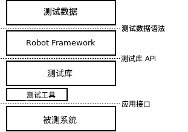
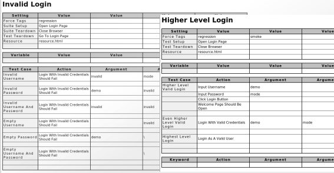

# 1.1 介绍

Robot Framework 是一种基于 python 的可扩展关键字驱动的自动化测试框架,通常用于端到端的验收测试和验收测试驱动开发。它可以用于测试声明涉及到多种技术和接口的分布式、异构的应用系统。

这个框架有丰富的生态系统,包括各种通用的测试库和工具作为单独项目开发。更多资料关于 Robot Framework 和它的生态系统,请参考: http://robotframework.org 。

Robot Framework是在 [Apache License 2.0](http://apache.org/licenses/LICENSE-2.0) 许可证下发布的开源软件。它的发展是由 [Robot Framework Foundation](http://robotframework.org/foundation) 赞助。

* 1.1.1   为何选择Robot Framework?
* 1.1.2   高层次的架构
* 1.1.3   屏幕截图
* 1.1.4   获取更多信息
	* 项目页面
	* 邮件列表

## 1.1.1 为何选择 Robot Framework?

- 使用容易使用的表格语法,用统一格式[创建测试用例](../CreatingTestData/CreatingTestCases.md#22-创建测试用例)。
- 提供重复利用已经存在的关键字来创建[高层次关键字](../CreatingTestData/CreatingUserKeywords.md#26-创建用户关键字)的能力。
- 提供易于阅读结果,采用 HTML 格式的[报告]()和[日志]()。
- 平台与被测系统应用程序相互独立。
- 提供用于创建自定义测试库的简单[库API](),它可以使用Python或Java本地实现。
- 提供[命令行界面]()和基于XML的[输出文件](),用于集成到现有构建基础架构(持续集成系统)中。
- 提供对 Selenium 的 Web 测试,Java GUI 测试,运行的支持进程,Telnet,SSH等的支持。
- 支持创建[数据驱动测试用例]()。
- Built-in 支持不同环境下的特殊[变量](../CreatingTestData/Variables.md#25-变量)。
- 提供[标记]()以对要执行的测试用例进行分类和[选择]()。
- 实现与源代码控制的轻松集成:[测试集]()是可以使用生产代码进行版本化的文件和目录。
- 提供[测试用例]()和[测试集]()级别的 setup 和 teardown。
- 模块化的结构甚至支持为有多种接口的应用程序创建测试数据。

## 1.1.2 高层次的架构

Robot Framework 是一个通用的，应用和技术相互独立的框架。它有一个高度模块化的架构图如下。

Robot Framework 架构图

[测试数据]()以一种简单易于编辑的表格格式。当 Robot Framework 启动的时候，启动测试数据，[执行测试用例]()并且生成日志和报告。核心框架不知道任何关于被测目标系统的细节，核心框架与被测系统通过[测试库]()进行交互。测试库能够直接使用应用程序接口或者使用更低层次的测试工具作为驱动。

## 1.1.3 屏幕截图

以下屏幕截图展示了[测试数据]()和创建的[报告]()和[日志]()的例子。

测试用例文件

报告和日志

## 1.1.4 获取更多信息

### 项目页面

查找有关 Robot Framework 的更多信息和它周围的丰富的生态系统,首要的地方是 http://robotframework.org。 Robot Framework 本身托管在 [GitHub](https://github.com/robotframework/robotframework) 上。

### 邮件列表

这里有几个 Robot Framework 邮件列表可以提问和搜索更多信息。 邮件列表档案对每个人（包括搜索引擎）都是开放的,每个人都可以自由加入这些列表。 只有列表成员可以发送电子邮件,为了防止垃圾邮件,新用户需要被审核， 这意味着它在你的第一条消息通过之前可能需要一个很少的时间。 不要害怕发送问题到邮件列表，但要记住[提问的技巧](http://www.catb.org/~esr/faqs/smart-questions.html)。

[robotframework-users](http://groups.google.com/group/robotframework-users)

* 通常讨论关于 Robot Framework 相关的问题。疑问和难题都可以发送到这个邮件列表。所有用户将分享这些信息。

[robotframework-announce](http://groups.google.com/group/robotframework-announce)

* 一个只读公告邮件列表仅有管理员能够发送消息。所有公告被发送到 Robot Framework 的用户邮件列表当中, 所以没必要同时加入两个列表中。

[robotframework-devel](http://groups.google.com/group/robotframework-devel)

* 讨论关于 Robot Framework 的开发。